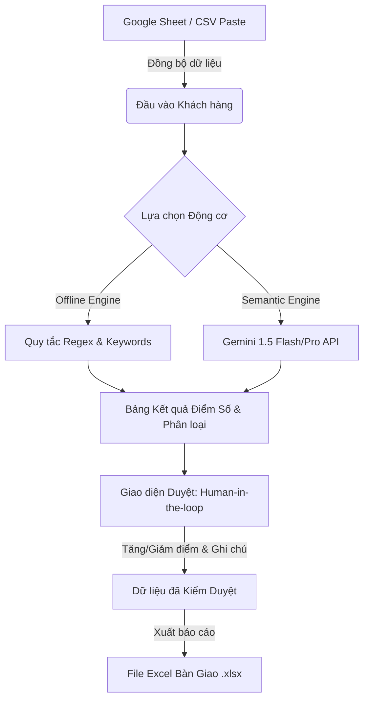

# AI Lead Scoring & Automation - Real Estate Skill

Hệ thống chấm điểm và tự động hóa phân loại khách hàng tiềm năng bất động sản (Lead Scoring) tích hợp Google Sheets, động cơ chấm điểm kép (Offline Regex & Online Gemini Semantic AI), giao diện hậu kiểm tương tác (Human-in-the-loop) và xuất dữ liệu bàn giao Excel.

---

## 1. Yêu cầu & Bộ Tiêu chí Chấm điểm (tieu_chi_cham_diem.txt)

Hệ thống phân loại khách hàng tiềm năng dựa trên nội dung mô tả nhu cầu chi tiết thành 3 nhóm điểm:

### A. Nhóm VIP / Siêu Tiềm Năng (+50 điểm -> Tổng: 100 điểm)
Phát hiện các đặc trưng chất lượng cao:
- **Ngân sách lớn**: Từ 20 tỷ trở lên hoặc các từ khóa "tài chính mạnh", "không thành vấn đề", "tài chính khủng".
- **Loại hình cao cấp**: "Biệt thự đơn lập", "Penthouse", "Shophouse mặt đường lớn", "Quỹ đất công nghiệp", "Sàn văn phòng diện tích lớn".
- **Vị trí đắc địa**: "Quận 1", "Q1", "Ven sông", "Vinhomes Ocean Park", "Phú Mỹ Hưng".
- **Đối tượng VIP**: "Chủ doanh nghiệp", "Giám đốc", "Nhà đầu tư chuyên nghiệp", "Mua sỉ", "Mua số lượng lớn".
- **Tính cấp thiết & Minh bạch**: "Pháp lý chuẩn 100%", "Sổ hồng riêng", "Gặp trực tiếp chủ đầu tư để đàm phán", "Làm việc chính chủ".

### B. Nhóm Rác / Không Tiềm Năng (-50 điểm -> Tổng: 0 điểm)
Tự động loại bỏ các liên hệ kém chất lượng:
- **Yêu cầu phi thực tế**: Tìm mua bất động sản với giá thấp vô lý so với thị trường (VD: Nhà Quận 1 giá 1-2 tỷ, biệt thự trung tâm hẻm xe hơi giá vài trăm triệu).
- **Không có nhu cầu**: "Nhầm số", "Nhầm máy", "Không có nhu cầu", "Dữ liệu cũ", "Nhầm ngành".
- **Không thiện chí**: "Hỏi giá cho vui", "Chưa có ý định mua", "Thái độ không hợp tác".
- **Spam/Quảng cáo**: Dịch vụ khác như "Bảo hiểm", "Vay vốn", "Mời chào dịch vụ", "Chạy lead".
- **Thông tin liên lạc lỗi**: "Thuê bao", "Gọi nhiều lần không bắt máy", "Không phản hồi Zalo".

### C. Các trường hợp thông thường (Giữ nguyên -> Tổng: 50 điểm)
Khách hàng có nhu cầu thực tầm trung:
- Mua chung cư, nhà phố tầm trung (3-10 tỷ).
- Cần vay ngân hàng, đang cân nhắc chính sách.
- Có nhu cầu thực nhưng cần tư vấn thêm về pháp lý hoặc vị trí.

---

## 2. Kiến trúc Hệ thống (System Architecture)



Hệ thống được phát triển dưới dạng **Single Page Application (SPA)** dùng HTML5, CSS3 Glassmorphism và Vanilla JavaScript, giúp chạy trực tiếp trên trình duyệt mà không cần cài đặt node_modules phức tạp, tối ưu cho việc nộp bài tập hoặc chạy thực tế gọn nhẹ.

---

## 3. Cấu trúc Thư mục Codebase

```
Thuchanhb7/
├── index.html            # Giao diện chính và bố cục Dashboard Web App (HTML/JS)
├── styles.css            # Thiết kế Glassmorphism tối ưu hiển thị, Responsive
├── app.js                # Logic cốt lõi: xử lý Sheets, regex engine, gọi API Gemini, xuất Excel
├── app_lead_scoring.py   # Script Python tự động tải Sheets, chấm điểm & kết xuất Excel cục bộ (Offline CLI)
├── app_streamlit.py      # Giao diện Web App Streamlit tương tác (Human-in-the-loop, offline)
├── requirements.txt      # Thư viện dependencies (pandas, requests, openpyxl, streamlit)
├── tieu_chi_cham_diem.txt # Bản gốc tiêu chí chấm điểm từ đề bài
└── lead_scoring_skill.md # Hướng dẫn vận hành và kiến trúc của kỹ năng này
```

---

## 4. Hướng dẫn Sử dụng Chi tiết

### Phương Án 1: Vận hành Giao diện Web App (Human-in-the-loop)

#### Bước 1: Khởi tạo và chạy ứng dụng cục bộ
Bạn có thể mở trực tiếp file index.html bằng trình duyệt Web (Chrome/Safari), hoặc khởi chạy máy chủ HTTP cục bộ nhanh bằng câu lệnh:
```bash
python3 -m http.server 8000
```
Sau đó truy cập địa chỉ `http://localhost:8000`.

#### Bước 2: Tải dữ liệu khách hàng
1. **Qua Google Sheets**: Dán liên kết Google Sheets của bạn vào ô nhập liệu ở Tab "Google Sheet". Bấm **"Đồng bộ & Chấm điểm"**.
   * *Mẹo vượt lỗi CORS*: Nếu Google Sheet ở dạng riêng tư, trình duyệt sẽ chặn hoặc trả về 404. Hệ thống đã cài sẵn một Proxy dự phòng. Tuy nhiên để ổn định nhất, hãy cấu hình Sheet ở chế độ **"Bất kỳ ai có liên kết đều có thể xem"**.
2. **Nhập CSV Thủ công**: Nếu không muốn kết nối mạng, chuyển sang Tab "Paste CSV/Raw" dán trực tiếp dữ liệu từ Excel của bạn vào và bấm xử lý.
3. **Dữ liệu Mẫu (Mock Data)**: Bấm nút **"Nạp dữ liệu mẫu chấm thử"** để nạp ngay 10 khách hàng chứa các kịch bản thực tế (3 VIP, 4 Thường, 3 Rác) để kiểm thử tức thì.

#### Bước 3: Cấu hình Gemini AI (Tùy chọn nâng cao)
Mặc định ứng dụng chạy ở chế độ **Offline Rules Engine** sử dụng Regex tiếng Việt rất chính xác. Để kích hoạt trí tuệ nhân tạo:
1. Bật nút gạt **"Chế độ Chấm điểm AI"** sang màu tím.
2. Bấm nút **"Cấu hình AI"** ở góc trên bên phải.
3. Nhập **Gemini API Key** (lấy miễn phí từ Google AI Studio) và chọn Model (ví dụ: `gemini-1.5-flash`).
4. Bấm **"Lưu cấu hình"**.
Hệ thống sẽ chuyển sang phân tích ngữ nghĩa tự nhiên của tiếng Việt.

#### Bước 4: Kiểm duyệt dữ liệu (Human-in-the-loop)
Hệ thống hiển thị trạng thái của từng khách hàng kèm các từ khóa nổi bật được tô màu (xanh cho VIP, đỏ cho Rác).
* **Duyệt nhanh**: Bấm nút tick xanh để chuyển trạng thái thành **Đã duyệt**.
* **Loại nhanh**: Bấm nút X đỏ để đánh dấu là **Rác/Loại bỏ**.
* **Hiệu chỉnh chi tiết**: Bấm nút bánh răng màu xám bên cạnh mỗi dòng để mở Modal kiểm duyệt. Tại đây bạn có thể thay đổi thủ công điểm số cuối cùng (100, 50, 0), cập nhật tên/số điện thoại, và viết ý kiến phê duyệt vào mục **Ghi chú nghiệp vụ**.

#### Bước 5: Xuất File Excel Bàn Giao
Bấm nút **"Xuất Excel bàn giao"** ở góc trên cùng bên phải. Hệ thống sử dụng thư viện SheetJS để kết xuất toàn bộ danh sách khách hàng gồm cả điểm AI ban đầu, điểm kiểm duyệt cuối cùng, lý do chấm điểm và ghi chú nghiệp vụ ra định dạng tệp tin Excel chuyên nghiệp `.xlsx`.

### Phương Án 2: Vận hành thông qua Python CLI Script (Tự động hóa hoàn toàn)

Để tự động hóa quy trình phân tích hàng loạt, tải trực tiếp và chấm điểm cục bộ không cần mở trình duyệt:

#### Bước 1: Cài đặt thư viện dependencies
Chạy lệnh cài đặt các thư viện cần thiết từ file `requirements.txt`:
```bash
pip install -r requirements.txt
```

#### Bước 2: Khởi chạy chấm điểm tự động
1. **Chấm điểm trực tiếp bằng Google Sheets mặc định**:
   ```bash
   python3 app_lead_scoring.py
   ```
2. **Chạy ở chế độ dữ liệu thử nghiệm (Demo)**:
   ```bash
   python3 app_lead_scoring.py --demo
   ```
3. **Chấm điểm từ file dữ liệu CSV/Excel cục bộ**:
   ```bash
   python3 app_lead_scoring.py --input-file path/to/leads.csv --output KetQuaChonLoc.xlsx
   ```

#### Các tham số cấu hình tùy chọn:
- `--sheet-url`: URL Google Sheet cần xử lý (mặc định lấy link Sheet đề bài cung cấp).
- `--input-file`: Đường dẫn file dữ liệu cục bộ `.csv` hoặc `.xlsx`.
- `--output`: Đường dẫn lưu file Excel kết quả (mặc định là `BanGiao_AI_LeadScoring.xlsx`).
- `--demo`: Bật chế độ chấm thử với bộ dữ liệu 10 khách hàng có sẵn.

### Phương Án 3: Vận hành Giao diện Web App Streamlit (Tối ưu hóa Python)

Streamlit cung cấp giải pháp giao diện web tương tác nhanh bằng Python, cho phép quản lý luồng phê duyệt và xuất báo cáo hoàn hảo.

#### Bước 1: Khởi chạy Streamlit cục bộ
Đảm bảo đã chạy lệnh `pip install -r requirements.txt`, sau đó khởi chạy ứng dụng bằng lệnh:
```bash
streamlit run app_streamlit.py
```
Ứng dụng sẽ tự động mở trên trình duyệt của bạn (mặc định tại địa chỉ `http://localhost:8501`).

#### Bước 2: Đồng bộ dữ liệu
- Dán link Google Sheets và bấm **"Đồng bộ Google Sheet"** ở sidebar bên trái.
- Hoặc kéo thả trực tiếp tệp tin `.csv` / `.xlsx` từ máy tính vào ô tải tệp.
- Hoặc bấm **"Nạp 10 khách hàng mẫu"** để test tính năng ngay lập tức.

#### Bước 3: Phê duyệt nghiệp vụ (Human-in-the-loop)
- Chọn mã số STT khách hàng trong hộp kiểm duyệt ở cột bên phải.
- Chỉnh sửa thông tin Họ tên, Số điện thoại trực tiếp.
- Điều chỉnh điểm số (100, 50, 0), cập nhật trạng thái duyệt (Đã duyệt, Đã loại) và điền ghi chú. Bấm **"Lưu Phê Duyệt"** để cập nhật trực tiếp.

#### Bước 4: Tải tệp Excel
Bấm nút **"Xuất file Excel bàn giao (.xlsx)"** ở dưới cùng bảng dữ liệu để nhận file Excel được thiết kế kiểu dáng chuyên nghiệp, tự động hóa toàn bộ quy trình.

---

## 5. Hướng dẫn Chấm điểm Chi tiết bằng Mã nguồn (Tham khảo)

Bộ khung chấm điểm bằng Regex trong app.js được phát triển tối ưu cho tiếng Việt bản địa:
```javascript
// Phát hiện VIP: Ngân sách lớn
const budgetKeywords = ['tài chính mạnh', 'không thành vấn đề', 'tài chính khủng', 'ngân sách lớn'];
const budgetRegex = /(\d+)\s*(tỷ|ty|bình)/g; // Trích xuất con số trước từ khóa tỷ

// Phát hiện VIP: Loại hình cao cấp
const premiumTypes = ['biệt thự đơn lập', 'penthouse', 'shophouse mặt đường', 'shophouse lớn', 'đất công nghiệp', 'sàn văn phòng'];

// Phát hiện Rác: Yêu cầu phi thực tế (Ví dụ: Trung tâm/Biệt thự đi kèm giá siêu rẻ 1-2 tỷ)
const centralKeywords = ['quận 1', 'q1', 'trung tâm', 'phú mỹ hưng'];
const cheapPriceKeywords = ['1 tỷ', '2 tỷ', '1-2 tỷ', 'trăm triệu', 'vài trăm triệu'];
```
Mô hình Semantic AI (Gemini) sử dụng định dạng đầu ra bắt buộc dưới dạng JSON schema để đảm bảo tính đồng nhất dữ liệu khi kết xuất.
