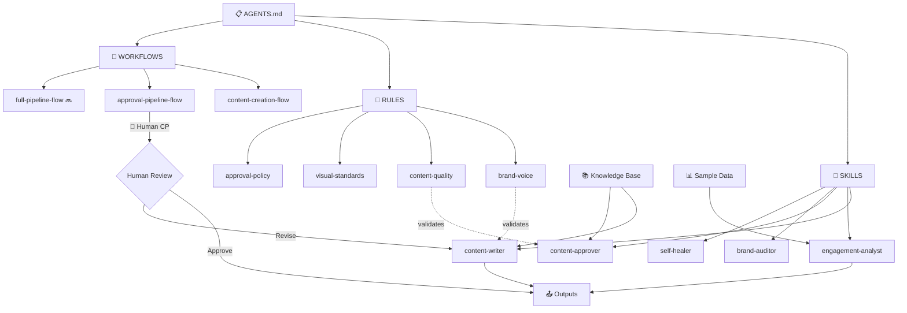

# SESSION 10 — Thiết Kế Kiến Trúc SCOPE

> **Thời lượng:** 3 giờ (Demo 45 phút + Thực hành 90 phút + Wrap-up 15 phút)  
> **Mục tiêu:** HV nắm SCOPE framework, vẽ architecture diagram, review tất cả components  
> **Vai trò:** GV trên Workspace A (đã hoàn chỉnh) | HV trên Workspace B (của mình)  
> **Prerequisite:** Hoàn thành buổi 9 (đã có self-healer + debug-backlog)

---

## 📋 TRẠNG THÁI WORKSPACE KHI VÀO BUỔI 10

```
personal-brand-workspace/
├── AGENTS.md
├── .agents/
│   ├── skills/
│   │   ├── content-writer/SKILL.md
│   │   ├── engagement-analyst/SKILL.md
│   │   ├── content-approver/SKILL.md
│   │   ├── brand-auditor/SKILL.md
│   │   └── self-healer/SKILL.md          ← MỚI từ buổi 9
│   ├── rules/
│   │   ├── brand-voice.md                 ← ĐÃ FIX buổi 9
│   │   ├── content-quality.md
│   │   ├── visual-standards.md
│   │   └── approval-policy.md
│   └── workflows/
│       ├── content-creation-flow.md
│       └── approval-pipeline-flow.md      ← ĐÃ FIX buổi 9
├── knowledge-base/
│   ├── brand-profile.md
│   ├── target-audience.md
│   ├── content-pillars.md
│   └── brand-guidelines.md
├── sample-data/ (5 CSVs — all quality checked)
├── outputs/
│   ├── content-drafts/
│   └── analytics-reports/
└── docs/
    ├── workspace-map.md
    ├── pdca-log.md                        ← 2 iterations
    ├── handoff-contracts.md
    ├── audit-report.md
    ├── debug-backlog.md                   ← MỚI từ buổi 9
    └── lesson-to-workspace-map.md
```

---

## PHẦN 1: DEMO — GV THỰC HIỆN (45 phút)

### 🎯 Mục tiêu Demo

GV sẽ áp dụng SCOPE framework để **thiết kế kiến trúc tổng thể** cho Personal Brand Builder workspace, review tất cả components, và tạo project brief hoàn chỉnh.

> 💡 **Mẹo GV:** Buổi này là "zoom out" — nhìn toàn cảnh. So sánh: "Buổi 1-9 chúng ta xây từng viên gạch. Buổi 10 chúng ta nhìn BẢN VẼ toàn bộ ngôi nhà."

---

### PHẦN A: SCOPE Analysis [15 phút]

#### SCOPE là gì?

| Chữ | Ý nghĩa | Câu hỏi trả lời |
|-----|---------|------------------|
| **S** | **Situation** | Tình huống hiện tại là gì? Đang làm gì, như thế nào? |
| **C** | **Constraints** | Giới hạn, rào cản, rủi ro là gì? |
| **O** | **Objectives** | Mục tiêu cụ thể, đo lường được? |
| **P** | **Process** | Hệ thống components nào cần? |
| **E** | **Evaluation** | Đánh giá, timeline, criteria? |

---

#### S — SITUATION: Tình huống hiện tại

📋 **Prompt SCOPE-S — Copy & Paste:**

```
Phân tích SITUATION (tình huống hiện tại) cho Personal Brand Builder:

1. MÔ TẢ QUY TRÌNH THỦ CÔNG HIỆN TẠI:
   - Content creator làm gì mỗi ngày?
   - Mất bao lâu cho mỗi task?
   - Quản lý bao nhiêu platforms?

2. PAIN POINTS:
   - Những gì tốn thời gian nhất?
   - Những gì hay bị sai/thiếu?
   - Những gì khiến mệt mỏi nhất?

3. CURRENT TOOLS:
   - Đang dùng tool gì?
   - Tool nào hoạt động tốt?
   - Tool nào cần thay thế?

Viết dưới dạng narrative paragraph, không bullet points.
```

**📊 Expected SCOPE-S Output:**

```markdown
### S — SITUATION

Hiện tại, một content creator xây dựng thương hiệu cá nhân đang phải
dành 3-4 giờ mỗi ngày cho quy trình thủ công: brainstorm ý tưởng (30 phút),
viết nội dung (60-90 phút), chỉnh sửa format cho từng platform (30-45 phút),
review lại (15-20 phút), và đăng bài (15-20 phút). Quy trình này lặp lại
cho 4-6 platforms: LinkedIn, Facebook, Instagram, TikTok, YouTube, và Blog.

Những pain points lớn nhất:
- **Thời gian:** 70% thời gian dành cho repetitive tasks (format, resize, scheduling)
- **Consistency:** Giọng điệu không nhất quán giữa các platforms
- **Tracking:** Không có hệ thống theo dõi engagement, quyết định bằng "cảm giác"
- **Quality:** Rushed content vào cuối ngày, chất lượng giảm khi mệt
- **Scalability:** Muốn tăng output nhưng không có thêm thời gian

Current tools: Canva (design), Google Docs (viết), Excel (calendar),
manual posting trên từng platform. Không có automation, không có AI assistance.
```

---

#### C — CONSTRAINTS: Giới hạn và Rào cản

📋 **Prompt SCOPE-C — Copy & Paste:**

```
Phân tích CONSTRAINTS (giới hạn, rào cản) cho Personal Brand Builder:

1. TECHNICAL CONSTRAINTS:
   - AI limitations: hallucination, outdated info, format issues
   - Data quality: vấn đề đã gặp ở buổi 9
   - Integration: những gì AI KHÔNG THỂ làm

2. BUSINESS CONSTRAINTS:
   - Brand consistency: làm sao đảm bảo across platforms?
   - Human approval: bottleneck ở đâu?
   - Content sensitivity: topics cần cẩn thận?

3. RESOURCE CONSTRAINTS:
   - Thời gian: bao nhiêu giờ/ngày cho AI workflow?
   - Skills: user cần biết gì để vận hành?
   - Cost: API costs, tool subscriptions?

Với MỖI constraint, đề xuất MITIGATION strategy.
```

**📊 Expected SCOPE-C Output:**

```markdown
### C — CONSTRAINTS

| # | Constraint | Category | Mitigation |
|---|-----------|----------|------------|
| C1 | AI hallucinate facts/statistics | Technical | Fact-check rule + human review checkpoint |
| C2 | Ngày mơ hồ trong data (đã fix buổi 9) | Technical | Date validation trong self-healer |
| C3 | Rule conflict (đã fix buổi 9) | Technical | Single-owner policy + regular audit |
| C4 | Brand voice không nhất quán cross-platform | Business | Platform-specific rules trong brand-voice.md |
| C5 | Human approval bottleneck (1 người review) | Business | SLA 24h + escalation path |
| C6 | Sensitive topics (chính trị, tôn giáo) | Business | Blacklist topics trong content-quality.md |
| C7 | User cần training để vận hành workspace | Resource | Quickstart guide + workspace-map.md |
| C8 | Context window limit khi prompt dài | Technical | Chunking strategy + focused prompts |
```

---

#### O — OBJECTIVES: Mục tiêu Cụ thể

📋 **Prompt SCOPE-O — Copy & Paste:**

```
Định nghĩa OBJECTIVES (mục tiêu SMART) cho Personal Brand Builder:

1. EFFICIENCY: Thời gian hiện tại vs mục tiêu?
2. OUTPUT: Số lượng content hiện tại vs mục tiêu?
3. AUTOMATION: % tasks tự động vs manual?
4. CONSISTENCY: Đo consistency bằng gì? Target score?

Mỗi objective phải SMART: Specific, Measurable, Achievable, Relevant, Time-bound.
```

**📊 Expected SCOPE-O Output:**

```markdown
### O — OBJECTIVES

| KPI | Hiện tại | Mục tiêu | Timeline | Đo bằng |
|-----|----------|----------|----------|---------|
| Thời gian/ngày | 3-4 giờ | 45 phút | Buổi 11 | Time tracking |
| Content output | 1-2 posts/ngày | 4 posts/ngày | Buổi 11 | Post count |
| Automation rate | 0% | 80% | Buổi 11 | Task categorization |
| Brand consistency | ~60% (ước tính) | >90% | Buổi 11 | Brand audit score |
| Engagement tracking | Manual/monthly | Auto/weekly | Buổi 11 | Report generation |
| Error rate | Unknown | <5% | Buổi 12 | Self-healer reports |

**Nguyên tắc:** 80% tự động, 20% human review. AI làm heavy lifting, human quyết định final.
```

---

#### P — PROCESS: Hệ thống Components

📋 **Prompt SCOPE-P — Copy & Paste:**

```
Liệt kê TẤT CẢ components trong workspace:
1. SKILLS (folder/SKILL.md) — Tên, mục đích, MICRO check
2. RULES (flat .md) — Tên, mục đích, CLEAR check
3. WORKFLOWS (flat .md) — Tên, mục đích, OIPO check
4. KNOWLEDGE BASE (.md) — Tên, up-to-date?
5. SAMPLE DATA (.csv) — Tên, quality OK?
6. AGENTS.md — Reference đúng?
7. OUTPUTS — Organized đúng?

Vẽ DEPENDENCY MAP: component nào phụ thuộc component nào?
```

**📊 Expected SCOPE-P Output:**

```markdown
### P — PROCESS: Component Inventory

#### Skills (5 skills)
| Skill | Mission | Input | Output | MICRO |
|-------|---------|-------|--------|-------|
| content-writer | Tạo content theo brand voice | Topic + platform | Draft .md | ✅ |
| engagement-analyst | Phân tích metrics | CSV data | Report .md | ✅ |
| content-approver | Duyệt content theo standards | Draft .md | Approval/Feedback | ✅ |
| brand-auditor | Audit brand consistency | Workspace files | Audit report | ✅ |
| self-healer | Phát hiện + gợi ý fix lỗi | Workspace path | Diagnostic report | ✅ |

#### Rules (4 rules)
| Rule | Purpose | CLEAR |
|------|---------|-------|
| brand-voice | Quy định giọng điệu thương hiệu | ✅ |
| content-quality | Tiêu chuẩn chất lượng nội dung | ✅ |
| visual-standards | Quy chuẩn hình ảnh, format | ✅ |
| approval-policy | Quy trình duyệt và publish | ✅ |

#### Workflows (2 workflows + 1 planned)
| Workflow | Purpose | OIPO | Human Checkpoint |
|----------|---------|------|------------------|
| content-creation-flow | Tạo content từ đầu đến cuối | ✅ | ✅ |
| approval-pipeline-flow | Duyệt và publish content | ✅ | ✅ (fixed buổi 9) |
| full-pipeline-flow | End-to-end pipeline (buổi 11) | 🔜 | 🔜 |

#### Knowledge Base (4 files)
| File | Purpose | Up-to-date |
|------|---------|------------|
| brand-profile.md | Thông tin thương hiệu | ✅ |
| target-audience.md | Chân dung khách hàng | ✅ |
| content-pillars.md | Trụ cột nội dung | ✅ |
| brand-guidelines.md | Hướng dẫn thương hiệu | ✅ |

#### Sample Data (5 CSV files)
| File | Purpose | Quality |
|------|---------|--------|
| social-media-posts.csv | Lịch sử bài đăng | ✅ |
| monthly-report-data.csv | Dữ liệu báo cáo tháng | ✅ |
| content-calendar.csv | Lịch nội dung | ✅ (fixed buổi 9) |
| engagement-metrics.csv | Chỉ số tương tác | ✅ |
| audience-feedback.csv | Phản hồi khán giả | ✅ |
```

---

#### E — EVALUATION: Kế hoạch Đánh giá

📋 **Prompt SCOPE-E — Copy & Paste:**

```
Lập kế hoạch EVALUATION cho Personal Brand Builder:
1. TIMELINE: Buổi 10, 11, 12 — deliverable gì?
2. SUCCESS CRITERIA: Workspace chạy end-to-end? Skills có MICRO? Rules có CLEAR? Workflows có OIPO + Human CP?
3. TESTING PLAN: Bao nhiêu test cases? Pass/Fail criteria?
4. PRESENTATION CRITERIA: Demo live, architecture diagram, PDCA log, metrics
```

**📊 Expected SCOPE-E Output:**

```markdown
### E — EVALUATION

#### Timeline
| Buổi | Mục tiêu | Deliverable | Status |
|------|----------|-------------|--------|
| 10 | Thiết kế kiến trúc hoàn chỉnh | project-brief.md + workspace-map.md | 🔄 Đang làm |
| 11 | Lắp ráp + test hệ thống | orchestrator + full-pipeline + 10 test cases | 🔜 |
| 12 | Trình bày project | 7-slide presentation + live demo | 🔜 |

#### Success Criteria (Demo Day)
| # | Criterion | Weight | How to Verify |
|---|-----------|--------|---------------|
| 1 | Workspace chạy end-to-end | 25% | 5 requests qua full pipeline |
| 2 | Tất cả skills có MICRO spec | 15% | Review checklist |
| 3 | Tất cả rules có CLEAR format | 15% | Review checklist |
| 4 | Tất cả workflows có OIPO + Human CP | 15% | Review checklist |
| 5 | PDCA log ≥ 4 iterations | 15% | Count iterations |
| 6 | Presentation rõ ràng, thuyết phục | 15% | Rubric scoring |

#### Testing Plan
- 10 test cases (xem test matrix buổi 11)
- Pass criteria: ≥ 8/10 test cases pass
- Fail criteria: <6/10 hoặc bất kỳ critical failure
```

---

### PHẦN B: Architecture Diagram [10 phút]

> 💡 **Mẹo GV:** Vẽ diagram TRỰC TIẾP trên màn hình để HV thấy process.

📋 **Prompt Architecture Diagram — Copy & Paste:**

```
Vẽ architecture diagram cho Personal Brand Builder workspace.
Bao gồm 7 component types:
1. AGENTS.md (trung tâm điều phối)
2. Skills (5 skills)
3. Rules (4 rules)
4. Workflows (2 workflows hiện tại + 1 planned)
5. Knowledge Base (4 files)
6. Sample Data (5 CSV files)
7. Outputs (content-drafts/ + analytics-reports/)

Show arrows chỉ data flow, phân biệt human vs AI steps, highlight Human Checkpoints.
```

**📊 Expected Architecture Diagram:**

```
╔══════════════════════════════════════════════════════════════════════╗
║                    PERSONAL BRAND BUILDER                          ║
║                     Architecture Diagram                           ║
╠══════════════════════════════════════════════════════════════════════╣
║                                                                    ║
║  ┌──────────────────────────────────────┐                          ║
║  │           📋 AGENTS.md               │                          ║
║  │    (Trung tâm cấu hình workspace)    │                          ║
║  └─────────────────┬────────────────────┘                          ║
║                    │                                               ║
║          ┌─────────┼─────────┐                                     ║
║          ▼         ▼         ▼                                     ║
║  ┌──────────┐ ┌─────────┐ ┌───────────┐                           ║
║  │ 🤖 SKILLS│ │ 📏 RULES│ │ 🔄 FLOWS  │                           ║
║  ├──────────┤ ├─────────┤ ├───────────┤                           ║
║  │content-  │ │brand-   │ │content-   │                           ║
║  │ writer   │ │ voice   │ │ creation  │                           ║
║  │engage-   │ │content- │ │approval-  │                           ║
║  │ analyst  │ │ quality │ │ pipeline  │                           ║
║  │content-  │ │visual-  │ │full-      │                           ║
║  │ approver │ │standards│ │ pipeline  │                           ║
║  │brand-    │ │approval-│ │ (buổi 11) │                           ║
║  │ auditor  │ │ policy  │ └───────────┘                           ║
║  │self-     │ └─────────┘                                         ║
║  │ healer   │                                                      ║
║  └──────────┘                                                      ║
║       │                                                            ║
║       ▼                                                            ║
║  ┌──────────────────────────────────────┐                          ║
║  │        📚 KNOWLEDGE BASE             │                          ║
║  │  brand-profile │ target-audience     │                          ║
║  │  content-pillars │ brand-guidelines  │                          ║
║  └──────────────────────────────────────┘                          ║
║       │                                                            ║
║       ▼                                                            ║
║  ┌──────────────────────────────────────┐                          ║
║  │          📊 SAMPLE DATA              │                          ║
║  │  5 CSV files (all quality checked)   │                          ║
║  └──────────────────────────────────────┘                          ║
║       │                                                            ║
║       ▼                                                            ║
║  ┌──────────────────────────────────────┐                          ║
║  │           📤 OUTPUTS                 │                          ║
║  │  content-drafts/ │ analytics-reports/│                          ║
║  └──────────────────────────────────────┘                          ║
║                                                                    ║
╚══════════════════════════════════════════════════════════════════════╝
```

#### Mermaid Architecture Diagram



---

### PHẦN C: Review MICRO / CLEAR / OIPO [15 phút]

#### MICRO Specification Review (cho Skills)

| Chữ | Ý nghĩa | Câu hỏi kiểm tra |
|-----|---------|-------------------|
| **M** | **Mission** | Skill này làm GÌ? Mục đích rõ ràng? |
| **I** | **Input** | Nhận đầu vào GÌ? Format nào? |
| **C** | **Constraints** | Giới hạn, KHÔNG làm gì? Guardrails? |
| **R** | **Return format** | Output format thế nào? Template? |
| **O** | **Output** | Kết quả lưu ở đâu? File gì? |

📋 **Prompt Review MICRO — Copy & Paste:**

```
Review TẤT CẢ 5 skills trong .agents/skills/ theo MICRO checklist:
Với MỖI skill: [M] Mission, [I] Input, [C] Constraints, [R] Return format, [O] Output
Đánh giá: ✅ Đạt | ⚠️ Cần cải thiện | ❌ Thiếu
Với mỗi ⚠️ hoặc ❌, đề xuất cách fix cụ thể.
```

#### CLEAR Specification Review (cho Rules)

| Chữ | Ý nghĩa | Câu hỏi kiểm tra |
|-----|---------|-------------------|
| **C** | **Concise** | Ngắn gọn, không dài dòng? |
| **L** | **Literal** | Rõ ràng, không mơ hồ? Có thể hiểu 1 cách duy nhất? |
| **E** | **Exhaustive** | Cover đủ tất cả trường hợp? |
| **A** | **Actionable** | Có thể thực hiện ngay? Không cần hỏi thêm? |
| **R** | **Ranked** | Có priority khi conflict? Rule nào ưu tiên hơn? |

📋 **Prompt Review CLEAR — Copy & Paste:**

```
Review TẤT CẢ 4 rules trong .agents/rules/ theo CLEAR checklist:
Với MỖI rule: [C] Concise, [L] Literal, [E] Exhaustive, [A] Actionable, [R] Ranked
Đánh giá: ✅ Đạt | ⚠️ Cần cải thiện | ❌ Thiếu
```

#### OIPO Specification Review (cho Workflows)

| Chữ | Ý nghĩa | Câu hỏi kiểm tra |
|-----|---------|-------------------|
| **O** | **Overview** | Mô tả tổng quan workflow? |
| **I** | **Input** | Input cần gì? Từ đâu? |
| **P** | **Process** | Các bước cụ thể? Human Checkpoints? |
| **O** | **Output** | Output là gì? Lưu ở đâu? |

📋 **Prompt Review OIPO — Copy & Paste:**

```
Review TẤT CẢ workflows trong .agents/workflows/ theo OIPO checklist:
Với MỖI workflow: [O] Overview, [I] Input, [P] Process, [O] Output
Đặc biệt kiểm tra: Human Checkpoint trước publish? Error handling? Timeout/SLA?
```

---

### PHẦN D: Project Brief [5 phút]

📋 **Prompt tạo Project Brief — Copy & Paste:**

```
Tạo file docs/project-brief.md với SCOPE analysis đầy đủ cho Personal Brand Builder.
Bao gồm: Executive Summary, SCOPE (S,C,O,P,E), Architecture Diagram, Timeline, Risks, Next Steps.
```

**📄 Nội dung `docs/project-brief.md`:**

```markdown
# Project Brief: Personal Brand Builder

> Ngày tạo: {{current_date}}
> Phiên bản: 1.0
> Tác giả: {{student_name}}

## 1. Executive Summary

Xây dựng hệ thống AI-powered workspace để tự động hóa 80% quy trình
tạo và quản lý nội dung thương hiệu cá nhân, giảm thời gian từ 3-4 giờ/ngày
xuống còn 45 phút/ngày, đồng thời tăng gấp đôi output content.

## 2. SCOPE Analysis

### S — Situation
[Dán nội dung SCOPE-S từ demo]

### C — Constraints
[Dán bảng constraints + mitigations]

### O — Objectives
[Dán bảng KPIs]

### P — Process
[Dán component inventory tables]

### E — Evaluation
[Dán timeline + success criteria]

## 3. Architecture
[Dán architecture diagram]

## 4. Component Specifications
### 4.1 Skills (MICRO) — [Dán review results]
### 4.2 Rules (CLEAR) — [Dán review results]
### 4.3 Workflows (OIPO) — [Dán review results]

## 5. Timeline

| Buổi | Mục tiêu | Deliverables |
|------|----------|--------------|
| 10 | Thiết kế | project-brief.md, workspace-map.md cập nhật |
| 11 | Lắp ráp | orchestrator, full-pipeline, 10 test cases, PDCA 3+4 |
| 12 | Trình bày | 7-slide presentation, live demo |

## 6. Risks & Mitigations

| Risk | Probability | Impact | Mitigation |
|------|-------------|--------|------------|
| AI hallucination | Medium | High | Fact-check rule + human review |
| Rule conflict tái phát | Low | Medium | Single-owner + self-healer |
| Pipeline bottleneck | Medium | Medium | SLA + escalation path |
| Data quality degradation | Low | High | Regular self-healer scans |

## 7. Next Steps

1. ✅ Buổi 10: Hoàn thiện project-brief.md
2. 🔜 Buổi 11: Tạo workspace-orchestrator + full-pipeline-flow
3. 🔜 Buổi 11: Chạy 10 integration tests
4. 🔜 Buổi 12: Chuẩn bị presentation + demo
```

---

## PHẦN 2: THỰC HÀNH — HV TỰ LÀM (90 phút)

### Bài tập 1: Viết SCOPE Analysis (30 phút)

📋 **Prompt cho HV — Copy & Paste:**

```
Hãy giúp tôi viết SCOPE analysis cho workspace {{tên_workspace}} của tôi:

S — SITUATION: Tôi đang làm gì thủ công? Mất bao lâu? Pain points?
C — CONSTRAINTS: Giới hạn kỹ thuật? Business? Resource?
O — OBJECTIVES (SMART): Thời gian? Output? Automation? Quality?
P — PROCESS: Liệt kê tất cả skills, rules, workflows, knowledge, data
E — EVALUATION: Timeline buổi 10, 11, 12? Success criteria? Test plan?

Đọc workspace hiện tại của tôi và viết SCOPE phù hợp.
```

> ✅ **Checkpoint:** HV phải có SCOPE 5 sections đầy đủ.

### Bài tập 2: Vẽ Architecture Diagram (20 phút)

📋 **Prompt cho HV — Copy & Paste:**

```
Dựa trên workspace hiện tại, vẽ architecture diagram:
1. TEXT-BASED DIAGRAM: 7 component types, arrows data flow, Human Checkpoints
2. MERMAID DIAGRAM: relationships giữa components, dependencies
Bao gồm tất cả files hiện có trong workspace.
```

### Bài tập 3: Review + Fix Components (20 phút)

📋 **Prompt cho HV — Copy & Paste:**

```
Review TOÀN BỘ workspace theo 3 checklists:
1. MICRO check cho TẤT CẢ skills trong .agents/skills/
2. CLEAR check cho TẤT CẢ rules trong .agents/rules/
3. OIPO check cho TẤT CẢ workflows trong .agents/workflows/
Với mỗi component: ✅ Đạt | ⚠️ Cần cải thiện (đề xuất fix) | ❌ Thiếu (tạo bổ sung)
Sau khi review, tự động fix tất cả issues tìm thấy.
```

### Bài tập 4: Complete Project Brief (20 phút)

📋 **Prompt cho HV — Copy & Paste:**

```
Tạo hoặc update file docs/project-brief.md với:
1. Executive Summary (3-5 câu)
2. SCOPE Analysis đầy đủ (từ Bài tập 1)
3. Architecture Diagram (từ Bài tập 2)
4. Component Specifications (từ Bài tập 3)
5. Timeline (buổi 10, 11, 12)
6. Risks & Mitigations
7. Next Steps
```

📋 **Bonus: Update Workspace Map**

```
Update file docs/workspace-map.md để phản ánh:
- Tất cả files hiện có (sau buổi 9 fix + buổi 10 additions)
- Architecture diagram
- Component relationships
- SCOPE summary
```

---

## PHẦN 3: WRAP-UP (15 phút)

### Recap buổi 10

**GV tổng kết:**

1. **SCOPE Framework:** S (hiểu hiện trạng), C (biết giới hạn), O (mục tiêu SMART), P (inventory components), E (timeline + criteria)
2. **Architecture Thinking:** 7 component types, data flow, Human Checkpoints
3. **Quality Checks:** MICRO cho Skills, CLEAR cho Rules, OIPO cho Workflows
4. **Project Brief:** Document trung tâm cho project, reference cho buổi 11 và 12

### Preview buổi 11

> "Buổi 11 chúng ta sẽ LẮP RÁP — tạo orchestrator skill và full pipeline, chạy 10 integration tests, fix lỗi qua PDCA, và chuẩn bị cho Demo Day buổi 12."

---

## 📦 TRẠNG THÁI WORKSPACE SAU BUỔI 10

```
personal-brand-workspace/
├── AGENTS.md
├── .agents/
│   ├── skills/
│   │   ├── content-writer/SKILL.md
│   │   ├── engagement-analyst/SKILL.md
│   │   ├── content-approver/SKILL.md
│   │   ├── brand-auditor/SKILL.md
│   │   └── self-healer/SKILL.md
│   ├── rules/
│   │   ├── brand-voice.md                  ← CẬP NHẬT (thêm platforms)
│   │   ├── content-quality.md
│   │   ├── visual-standards.md             ← CẬP NHẬT (thêm YouTube specs)
│   │   └── approval-policy.md
│   └── workflows/
│       ├── content-creation-flow.md
│       └── approval-pipeline-flow.md
├── knowledge-base/ (4 .md files)
├── sample-data/ (5 CSVs — all quality checked)
├── outputs/
│   ├── content-drafts/
│   └── analytics-reports/
└── docs/
    ├── workspace-map.md                    ← CẬP NHẬT (full architecture)
    ├── pdca-log.md                         ← 2 iterations
    ├── project-brief.md                    ← HOÀN THIỆN ✨ (SCOPE)
    ├── handoff-contracts.md
    ├── audit-report.md
    ├── debug-backlog.md
    └── lesson-to-workspace-map.md
```

### Files thay đổi trong buổi 10:

| Thay đổi | File | Loại |
|----------|------|------|
| 🔄 CẬP NHẬT | `docs/project-brief.md` | Hoàn thiện SCOPE |
| 🔄 CẬP NHẬT | `docs/workspace-map.md` | Full architecture |
| 🔄 CẬP NHẬT | `.agents/rules/brand-voice.md` | Thêm missing platforms |
| 🔄 CẬP NHẬT | `.agents/rules/visual-standards.md` | Thêm YouTube specs |

---

## 📝 GHI CHÚ CHO GV

### Timing Guide

| Phần | Thời gian | Ghi chú |
|------|-----------|----------|
| SCOPE-S | 5 phút | Narrative, không bullet points |
| SCOPE-C | 5 phút | Bảng với mitigations |
| SCOPE-O | 5 phút | SMART objectives + KPI table |
| SCOPE-P | 5 phút | Component inventory |
| SCOPE-E | 5 phút | Timeline + success criteria |
| Architecture Diagram | 10 phút | Vẽ live, text + Mermaid |
| MICRO/CLEAR/OIPO Review | 10 phút | Show review process |
| Project Brief | 5 phút | Quick show template |
| **Tổng Demo** | **45 phút** | |
| HV SCOPE | 30 phút | HV viết SCOPE cho workspace mình |
| HV Architecture | 20 phút | HV vẽ diagram |
| HV Review Components | 20 phút | HV review MICRO/CLEAR/OIPO |
| HV Project Brief | 20 phút | HV complete project-brief.md |
| **Tổng Thực hành** | **90 phút** | |
| Wrap-up | 15 phút | Recap + Preview buổi 11 |

### Lỗi HV Hay Gặp

1. **SCOPE quá chung chung** → Nhắc viết cụ thể, có số liệu
2. **Architecture diagram thiếu components** → Đếm: phải có 7 types
3. **Bỏ qua Constraints** → Constraints quan trọng nhất cho realistic planning
4. **Project brief copy-paste không customize** → Phải điều chỉnh cho business case riêng
5. **Không update workspace-map.md** → Nhắc cập nhật sau mỗi thay đổi

### Câu Hỏi Thường Gặp

| Câu hỏi | Trả lời |
|---------|----------|
| "SCOPE khác SWOT thế nào?" | SCOPE focus vào workspace design, SWOT focus vào business strategy |
| "Có bắt buộc 7 components không?" | Tối thiểu: skills + rules + workflows. Knowledge/data tuỳ case |
| "MICRO/CLEAR/OIPO có bắt buộc?" | Strongly recommended — giúp AI hiểu chính xác |
| "Project brief dài bao nhiêu?" | 2-4 trang, đủ để người khác hiểu workspace |

---

**KẾT THÚC SESSION 10**
